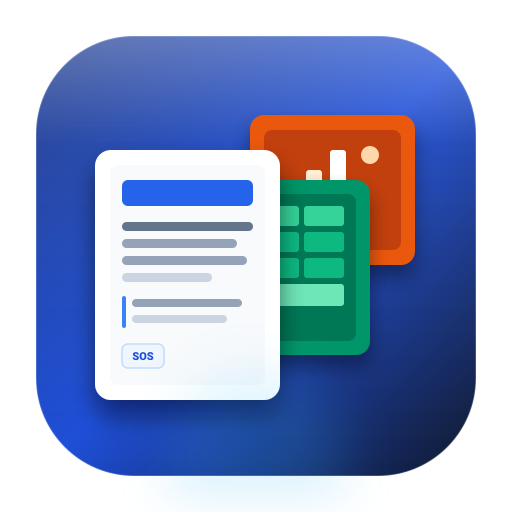

# Simple Office Suite (SOS)

<p align="center">
  
</p>

<p align="center">
  <strong>A lightweight, cross-platform, offline-first productivity suite built with Tauri 2.0 and Rust.</strong>
</p>

<p align="center">
  <a href="LICENSE"></a>
  <a href="https://v2.tauri.app/"></a>
  <a href="https://www.rust-lang.org/"></a>
  <a href="https://svelte.dev/"></a>
  
  
  
</p>

---

## 📖 Executive Summary & Vision

Modern office productivity suites have grown into multi-gigabyte browser-wrapped runtimes consuming over 1GB of idle RAM, demanding constant cloud logins, and exposing document data to remote telemetry.

**Simple Office Suite (SOS)** re-architects the essential office workflow from first principles:
- **Featherweight**: Native binary under **30MB**; active memory footprint under **150MB**.
- **100% Offline-First**: Zero external cloud calls, no forced accounts, no background tracking.
- **True Cross-Platform**: Native OS binaries for **macOS** (Universal Apple Silicon & Intel), **Linux** (Debian, Fedora, Arch, AppImage), and **Windows 10/11** (MSI/NSIS).
- **Direct OS Integration**: Standardized local file storage (`.sosw`, `.soss`, `.sosp`) with seamless import/export to `.csv`, `.md`, `.txt`, and printable `.pdf`.

---

## 🏛 System Architecture

Simple Office Suite pairs **Tauri 2.0 (Rust)** with an ultra-responsive **Svelte 5 & TypeScript** interface, communicating via high-throughput binary IPC.

```
+-------------------------------------------------------------------------+
|                       Simple Office Suite (SOS)                         |
+-------------------------------------------------------------------------+
|                                                                         |
|  +-------------------------------------------------------------------+  |
|  |                       Svelte 5 Frontend Layer                     |  |
|  |  +-------------------+  +-------------------+  +---------------+  |  |
|  |  |    SOS Writer     |  |    SOS Sheets     |  |  SOS Slides   |  |  |
|  |  |  (WYSIWYG A4 Canvas) | (Virtualized Grid)|  | (Deck Builder)|  |  |
|  |  +-------------------+  +-------------------+  +---------------+  |  |
|  |  +-------------------------------------------------------------+  |  |
|  |  |   Workspace Shell (Header, Navigation Tabs, StatusBar, UX)   |  |  |
|  |  +-------------------------------------------------------------+  |  |
|  +-------------------------------------------------------------------+  |
|                                   │                                     |
|             Tauri 2.0 IPC Bridge (Commands & Events)                    |
|                                   ▼                                     |
|  +-------------------------------------------------------------------+  |
|  |                        Rust Backend Core                          |  |
|  |  • Native Dialogs (tauri-plugin-dialog: open/save/filter)         |  |
|  |  • Direct File System I/O (tauri-plugin-fs: stream read/write)   |  |
|  |  • Local Recovery & Snapshot Cache (AppData/autosaves)            |  |
|  |  • System Metrics Engine (sysinfo: RAM, CPU, Platform state)      |  |
|  +-------------------------------------------------------------------+  |
|                                   │                                     |
|                                   ▼                                     |
|  +-------------------------------------------------------------------+  |
|  |                       Host Operating System                       |  |
|  |            macOS (Darwin)  •  Linux (X11/Wayland)  •  Windows     |  |
|  +-------------------------------------------------------------------+  |
+-------------------------------------------------------------------------+
```

---

## 📦 Suite Modules

### 1. SOS Writer (Word Processor)
- **Document Canvas**: High-performance A4 paginated canvas with paper drop shadows, margin guides, and clean typography.
- **Rich Formatting Toolbar**: Heading 1–3, paragraph style dropdown, bold, italics, underline, strikethrough, blockquotes, code blocks, bulleted and numbered lists.
- **Tables & Dividers**: Dynamic 3×3 table insertion and horizontal rule dividers.
- **Real-Time Word Count**: Word and character counts updated on every keystroke.
- **Export Formats**: One-click export to **Markdown (`.md`)**, plain text, and printable **PDF**.

### 2. SOS Sheets (Spreadsheet Engine)
- **Virtualized Grid**: High-performance table with sticky lettered columns (A–Z+) and numbered rows (1–100+).
- **Core Formula Engine**: Real-time evaluation with cycle protection:
  - `=SUM(A1:A10)`
  - `=AVERAGE(B1:B5)`
  - `=COUNT(C1:C20)`
  - `=IF(A1>50, "Approved", "Pending")`
  - `=MIN(...)` and `=MAX(...)`
  - Arithmetic operations (`+`, `-`, `*`, `/`)
- **Formula Bar**: Formula bar with active coordinate badge, `fx` trigger, in-place edit, and formula syntax helpers.
- **Data Persistence**: Direct **CSV import and export** alongside native JSON workbook state (`.soss`).

### 3. SOS Slides (Presentation Engine)
- **Deck Organizer**: Thumbnail sidebar to add, duplicate, reorder, and delete slides in 16:9 widescreen format.
- **Block-Based Canvas**: Drag-and-drop element containers:
  - Slide Titles and Subtitles
  - Multiline Text & Bulleted Lists
  - Highlight Cards & Shapes
  - Formatted Monospace Code Blocks
  - Image / Diagram Placeholders
- **Fullscreen Presenter View (F5)**:
  - Slide navigation with Left/Right arrows, Spacebar, or UI buttons.
  - Active presentation stopwatch / timer (Start, Pause, Reset).
  - Speaker notes panel toggle.

---

## ⚡ Performance Benchmarks

| Metric | Simple Office Suite (SOS) | Electron-Based Office Apps | Cloud Browser Suites |
| :--- | :--- | :--- | :--- |
| **Installed Binary Size** | **~18 MB - 25 MB** | 180 MB - 350 MB | N/A (Requires Browser) |
| **Idle Memory Usage** | **~42 MB** | 450 MB - 900 MB | 800 MB - 1.5 GB |
| **Cold Start Time** | **< 380 ms** | 2.5 s - 5.0 s | Network Dependent |
| **Cloud Tracking** | **0 Telemetry Bytes** | Telemetry Enabled | Constant Sync |
| **Full Offline Usability**| **100% Native** | Limited | Degraded / Cached |

---

## 📂 Project Directory Structure

```
simple-office-suite/
├── .github/
│   └── workflows/
│       └── release.yml          # Cross-platform CI/CD (macOS, Linux, Windows)
├── public/
│   └── logo.svg                 # Application brand vector logo
├── src/
│   ├── components/
│   │   ├── layout/
│   │   │   ├── Header.svelte    # Global shell, module switcher & file menu
│   │   │   └── StatusBar.svelte # Document metrics, word counts & system status
│   │   ├── writer/
│   │   │   ├── Writer.svelte        # Writer container & keyboard shortcuts
│   │   │   ├── WriterCanvas.svelte  # Paginated A4 canvas & DOM editor
│   │   │   └── WriterToolbar.svelte # Rich text formatting toolbar
│   │   ├── sheets/
│   │   │   ├── Sheets.svelte        # Sheets container & CSV operations
│   │   │   ├── FormulaBar.svelte    # Coordinate indicator & formula bar
│   │   │   ├── Grid.svelte          # Responsive table & cell renderer
│   │   │   └── formulaEngine.ts     # Formula parser (SUM, AVG, COUNT, IF, MIN, MAX)
│   │   └── slides/
│   │       ├── Slides.svelte        # Deck manager & canvas coordinator
│   │       ├── SlideCanvas.svelte   # 16:9 stage & interactive block layout
│   │       ├── SlideDeckSidebar.svelte # Thumbnail list & slide reordering
│   │       ├── SlideToolbar.svelte  # Block insertion & color controls
│   │       └── PresenterModal.svelte# Fullscreen presenter mode & timer
│   ├── lib/
│   │   ├── storage.ts           # Debounced auto-save & crash recovery engine
│   │   ├── tauri.ts             # Rust IPC command bridge + web dev fallback
│   │   └── utils.ts             # Markdown converter, PDF print & export utilities
│   ├── types/
│   │   └── index.ts             # Central TypeScript domain interfaces
│   ├── app.css                  # Tailwind styles & print stylesheet
│   ├── App.svelte               # Root component & state orchestrator
│   └── main.ts                  # Frontend entry point
├── src-tauri/
│   ├── capabilities/
│   │   └── default.json         # Tauri 2.0 system permission manifests
│   ├── src/
│   │   ├── lib.rs               # Rust native file dialogs, I/O & system info
│   │   └── main.rs              # Tauri runtime bootstrap
│   ├── build.rs                 # Cargo build hooks
│   ├── Cargo.toml               # Rust dependencies (tauri 2.0, sysinfo, dirs)
│   └── tauri.conf.json          # Window geometry, security CSP & bundle targets
├── .gitignore                   # Multi-stack Git ignore rules
├── index.html                   # HTML5 application shell
├── package.json                 # Node dependencies & automation scripts
├── postcss.config.js            # PostCSS pipeline
├── tailwind.config.js           # Palette & layout extensions
├── tsconfig.json                # TypeScript strict configuration
└── LICENSE                      # MIT Open Source License
```

---

## 🚀 Getting Started

### Prerequisites

1. **Node.js**: `v18.0+` or `v20.0+` (LTS recommended)
2. **pnpm** (preferred) or `npm` / `yarn`:
   ```bash
   npm install -g pnpm
   ```
3. **Rust Toolchain**: `stable` (v1.75+)
   ```bash
   curl --proto '=https' --tlsv1.2 -sSf https://sh.rustup.rs | sh
   ```
4. **Platform Build Dependencies**:
   - **macOS**: Xcode Command Line Tools (`xcode-select --install`)
   - **Linux (Ubuntu/Debian)**:
     ```bash
     sudo apt update && sudo apt install -y libwebkit2gtk-4.1-dev build-essential curl wget file libxdo-dev libssl-dev libayatana-appindicator3-dev librsvg2-dev
     ```
   - **Windows**: Microsoft Visual Studio C++ Build Tools & WebView2

---

## 🛠 Development & Build Commands

### 1. Install Dependencies
```bash
pnpm install
```

### 2. Run in Browser Development Mode (Vite)
You can run and test the full suite in any modern web browser without compiling Rust. The native file I/O layer automatically uses simulated browser storage:
```bash
pnpm dev
```
Navigate to `http://localhost:1420`.

### 3. Run Native Desktop App (Tauri Dev)
Launches the full desktop application backed by the Rust Tauri 2.0 process with hot-module reloading:
```bash
pnpm tauri dev
```

### 4. Build Production Binaries
Compiles the optimized release bundle for your current operating system:
```bash
pnpm tauri build
```

Built artifacts will be placed in `src-tauri/target/release/bundle/`:
- **macOS**: `.app` and portable `.zip` / `.dmg`
- **Linux**: `.AppImage` (standalone portable executable) & `.deb`
- **Windows**: `.exe` (NSIS user-space portable installer) & `.zip`

---

## 🚀 Zero-Driver & Portable Architecture

Simple Office Suite is engineered to be **100% driverless and user-space portable** across all operating systems:
- **No Kernel Extensions or System Drivers**: Uses OS-native user-space web rendering (WebKit on macOS/Linux, WebView2 on Windows) and pure Rust binaries.
- **No Elevated Permissions (Root/UAC) Required**:
  - **macOS**: Standalone `.app` bundle can be placed in `~/Applications` or run directly from anywhere.
  - **Windows**: NSIS installer defaults to `currentUser` installation mode (`%LOCALAPPDATA%`), requiring no administrator privileges or driver prompts.
  - **Linux**: Portable `.AppImage` runs on any Linux distribution with `chmod +x` without requiring root `sudo` or package manager changes.
  - **Web / Offline PWA**: Open directly in any modern browser with client-side persistence and zero installation.

---

## 🤖 Continuous Integration & Automated Releases

A GitHub Actions workflow is provided at `.github/workflows/release.yml`. When a Git tag is pushed (e.g., `git tag v1.0.0 && git push origin v1.0.0`), the workflow runs a cross-platform build matrix:
- Compiles macOS Universal binary (Apple Silicon + Intel).
- Compiles Linux `.AppImage` and `.deb` packages with webkit2gtk-4.1.
- Compiles Windows `.msi` installers.
- Automatically publishes a GitHub Release containing all installable binaries and checksums.

---

## 🔒 Security & Privacy Model

- **No Remote Sockets**: The application does not instantiate outbound HTTP or WebSocket connections.
- **Local File System Sandboxing**: File read and write operations are governed by user-initiated native dialog windows (`openFileDialogNative` / `saveFileDialogNative`).
- **Data Ownership**: Document files use open formats:
  - Plaintext Markdown (`.md`)
  - Comma-Separated Values (`.csv`)
  - Clean human-readable JSON (`.sosw`, `.soss`, `.sosp`)
  - Standard PDF print output

---

## 🤝 Contributing

Contributions to Simple Office Suite are welcome!

1. Fork the repository on GitHub.
2. Create a feature branch: `git checkout -b feature/amazing-feature`.
3. Verify formatting and types:
   ```bash
   pnpm check
   cargo check --manifest-path src-tauri/Cargo.toml
   ```
4. Commit your changes: `git commit -m "feat: add amazing feature"`.
5. Push to the branch: `git push origin feature/amazing-feature`.
6. Open a Pull Request.

---

## 📄 License

Simple Office Suite is distributed under the **MIT License**. See [LICENSE](LICENSE) for details.
